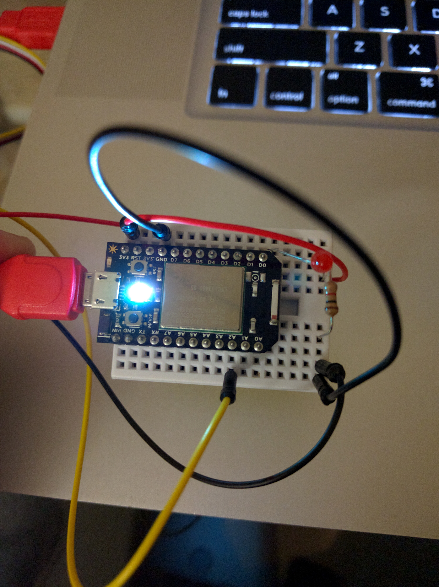

# Plant Monitor
Particle powered reminder to water the plant

## Overview
I have a plant.
  
I have a black thumb, and forget to water the plant.
  
I need something to remind me to water the plant.  Sounds like a perfect evening project.

## What you'll need
(or at least what I used)

1. Particle board (I had one laying around from the Kickstarter campaign, when it was still called a Spark core, so I figured I'd make use of it)
1. Breadboard of some sort - it's a pretty simple project, but there are a few things to connect
1. Moisture sensor - I used a Grove moisture sensor that I probably got from Adafruit, but here's a link to it on [seedstudio](http://www.seeedstudio.com/depot/Grove-Moisture-Sensor-p-955.html)
1. Red LED - this is just for a visual indicator that the plant needs water (there's an onboard LED that I'm also using to indicate that the program is running, but adding this was more fun)
1. 1k resistor (brown, black, red bands) - it doesn't have to be this exact one, but you need something around this resistance
1. [IFTT](https://ifttt.com/recipes) account
  
## Program

[plant_mon.ino](plant_mon.ino)

## Finished Project

 